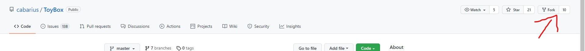
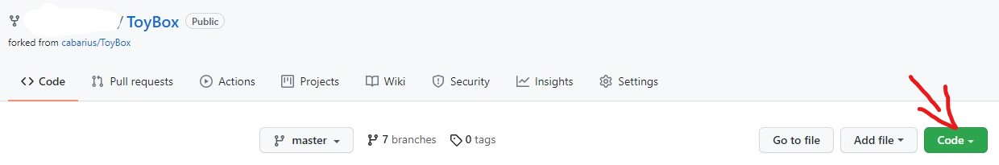
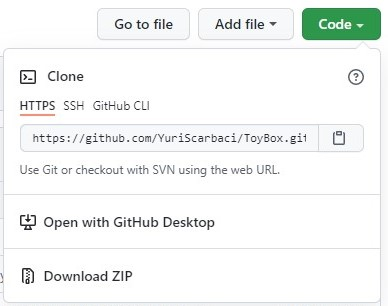
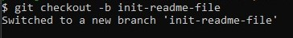

# About
Toy Box is a cute and playful mod with 500+ cheats, tweaks and quality of life improvements for Pathfinder: WoTR.

It was created in the spirit of Bag of Tricks & Cheat Menu but with a little different focus, It offers a powerful and convenient way to edit:
- the party composition
- stats
- search and add to party members:
  - Feats
  - Features
  - Items
  - etc.

Download: [nexusmods.com](https://www.nexusmods.com/pathfinderwrathoftherighteous/mods/8)

### Install & Setup (Wrath)

1. Install Unity Mod Manager.
2. Install the mod using the Unity Mod Manager ***or*** Modfinder ***or*** manually extract the archive to your game's mod folder (e.g. '\Steam\steamapps\common\Pathfinder Second Adventure\Mods').
3. Start the game and load a save or start a new save (the mod's functions can't accessed from the main menu).
4. Open the Unity Mod Manager by pressing CTRL + F10.
5. Adjust the settings in the mod's menu.

# How to contribute
- Make sure you have Visual Studio 22 (or current) installed and other tools you might want.  See [WotR Modding Beginners Guide](https://github.com/WittleWolfie/OwlcatModdingWiki/wiki/Beginner-Guide) for more info
- on the [main repository page](https://github.com/xADDBx/ToyBox) click on "fork" in the upper-right corner

- on your personal fork of the repository clone to your computer ([multiple method avaiable, chose the one you prefeer](https://docs.github.com/en/repositories/creating-and-managing-repositories/cloning-a-repository))


- create a branch in your fork with a short description of your contribution (e.g. `git checkout -b my-contribution-descriptor`)


- do your magic with the code
- push to your fork
- open a pull-request from your fork to the main repository

# Development Setup
1. Install ToyBox mod into your game via Unity Mod Manager
2. Clone the git repo
3. Build the solution once and restart Visual Studio
4. Now you can just change things and build the solution and it will automatically build and install into the mod folder in the game
5. **Important** If you are adding a feature or fixing a bug please add a release note entry to the *ReadMe.md*.  This is how we tell our the world about your great work^_^
    1. Find the highest release name near the top. It will look something like `### Ver 1.3.7 (Coming Soon)`. 
    2. Usually it is 0.0.1 higher than the current release. If not please add a new Version entry at the top for the next release using proper markdown. 
    3. Don't worry too much about getting this right as Maintainers will clean this up on merge so when in doubt add a new version.
    4. Format your release note like like this:
    >```* (***SomeContributor***) added a Coolness Multiplier in Bag of Tricks that makes your main character that much more awesome!```

**PS**: 
        
[Join our discord](https://discord.gg/owlcat) and go to #mod-dev-technical and #mod-user-general meet the mod authors. We love to chat about modding and teaching others to mod.
